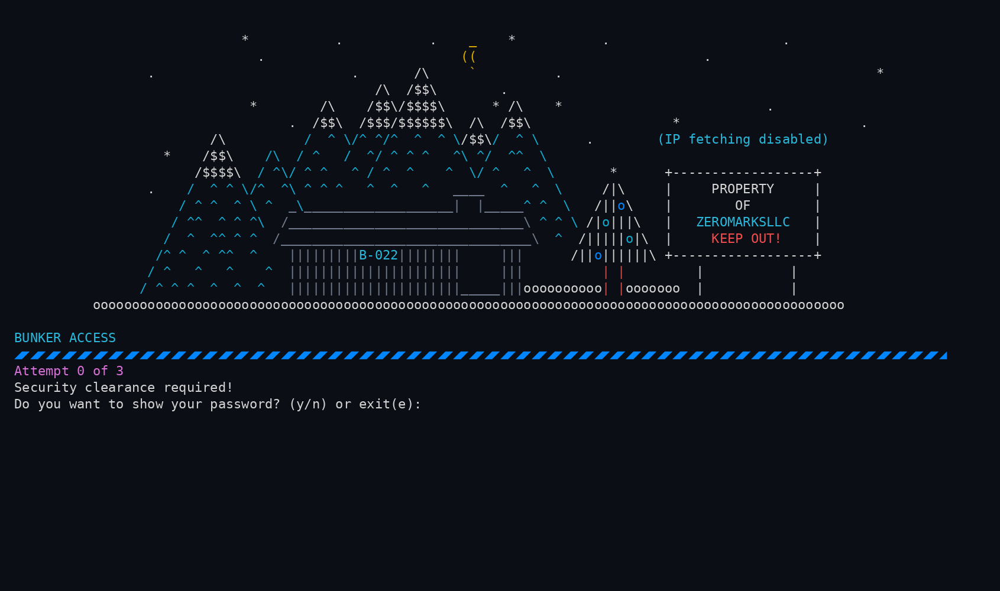
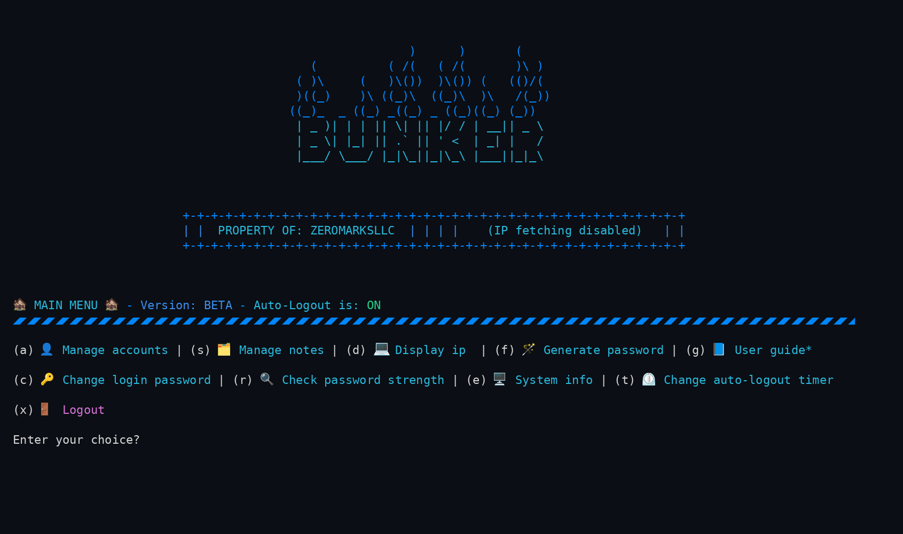
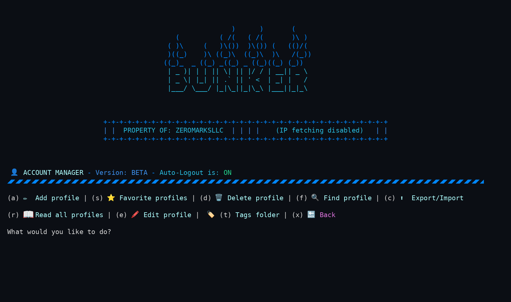
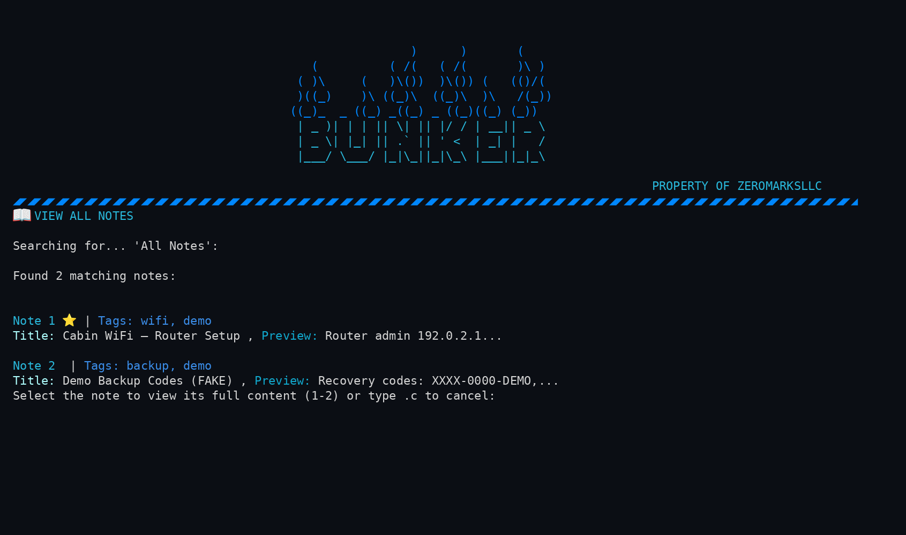
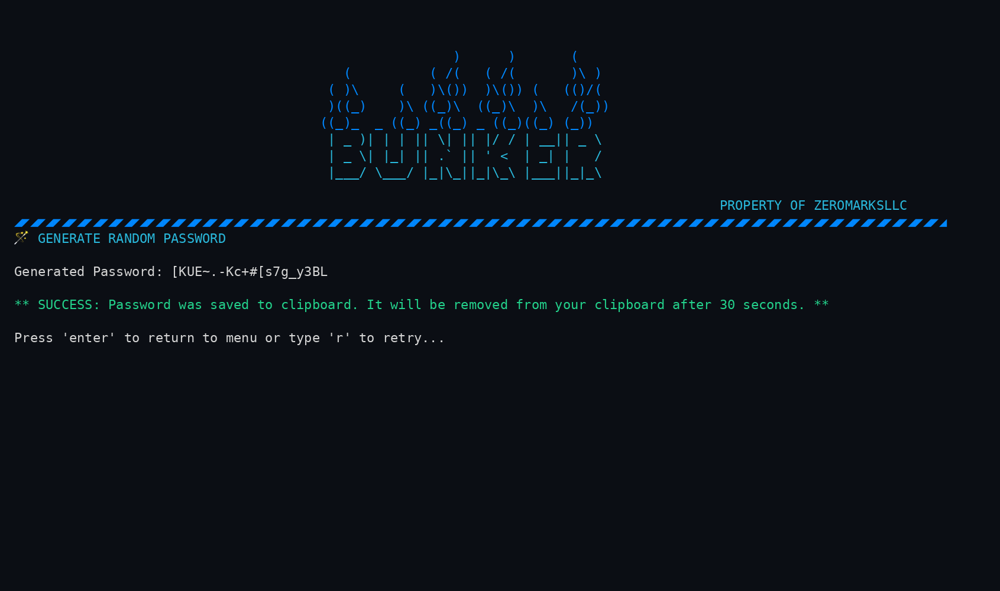
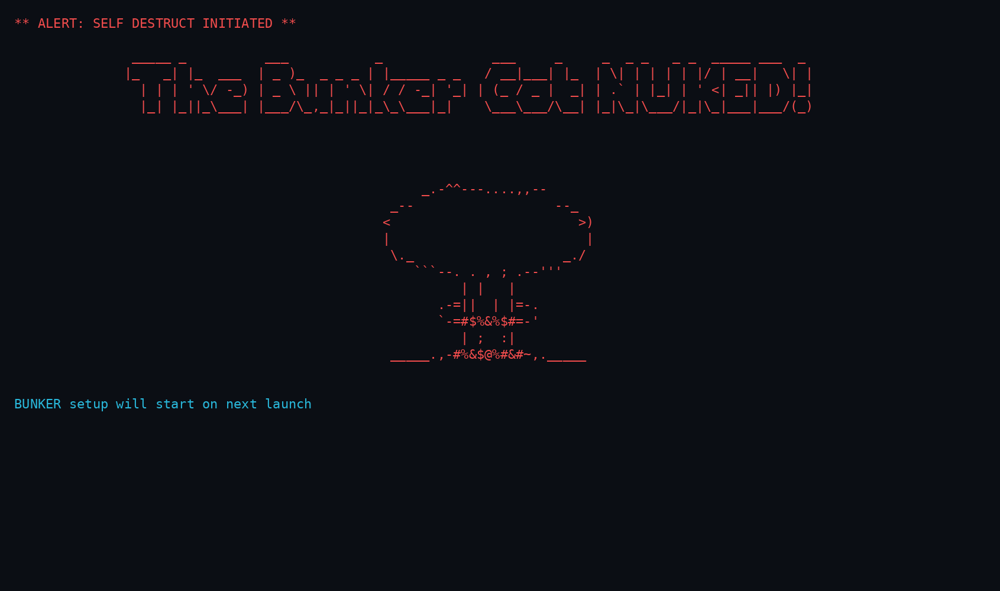

<div align="center">

# 🔐 BUNKER 2.0

**An offline, source-available terminal vault for passwords & notes — your data never leaves your machine.**

[-blue)](LICENSE.txt)
[](https://www.python.org/downloads/)
[](#-quick-start)
[](https://zeromarks.gumroad.com/l/vmnbz)
[](#-security-model)
[](#-roadmap)


<!-- TODO: replace with docs/img/bunker-demo.gif once recorded via `vhs bunker-demo.tape` -->

<br/>

**[▶ Watch the Demo](https://youtu.be/DxMICmnFs_Y)** &nbsp;·&nbsp;
**[💾 Get it on Gumroad — free / pay what you want](https://zeromarks.gumroad.com/l/vmnbz)** &nbsp;·&nbsp;
**[🐛 Report a Bug](https://github.com/zeromarksllc/BUNKER2.0/issues)**

</div>

---

BUNKER 2.0 is a privacy-first password and notes manager that lives entirely in your terminal. Everything is encrypted with industry-standard **AES-256-GCM** and stored in a single local file — no cloud, no account, no telemetry, no data mining. It's free (pay what you want), and every line of source is yours to read.

> 🖥️ **Full-screen terminal recommended** for the best experience.

---

## 📑 Table of Contents

- [Features](#-features)
- [Screenshots](#-screenshots)
- [Quick Start](#-quick-start)
- [The Burner Vault: Self-Destruct](#-the-burner-vault-self-destruct)
- [Security Model](#-security-model)
- [User Guide](#-user-guide)
- [Troubleshooting](#-troubleshooting)
- [FAQ](#-faq)
- [Roadmap](#-roadmap)
- [License & Disclaimer](#-license--disclaimer)
- [Connect with ZeroMarks](#-connect-with-zeromarks)

---

## ✨ Features

### 🔒 Encryption

| Feature | What it actually does |
| --- | --- |
| **AES-256-GCM vault** | Authenticated encryption — tampered ciphertext fails to decrypt instead of returning garbage. |
| **Argon2id + PBKDF2 key derivation** | Your master password is stretched with memory-hard Argon2id, then PBKDF2-HMAC-SHA3-256, before it ever becomes a key. |
| **No stored master password** | Your password is never written to disk — it's validated by a decryption challenge. |

### 🛡️ Protection

| Feature | What it actually does |
| --- | --- |
| **100% local storage** | One vault file (`Bunker.mmf`) on your machine. No cloud sync, no account, no tracking. |
| **Self-destruct lockout** | 3 failed logins wipes the vault (best-effort overwrite + secure-unlink) — a deliberate "burner vault" design. [Read the warning](#-the-burner-vault-self-destruct) before relying on it. |
| **Persistent attempt counter** | Failed attempts are remembered across restarts and reset **only** on a successful login. Restarting the app does not buy more guesses. |
| **Auto-logout timer** | Configurable inactivity logout. |
| **Clipboard auto-clear** | Copied secrets are wiped from the clipboard after 30 seconds. |

### ⚡ Convenience

| Feature | What it actually does |
| --- | --- |
| **Password generator** | Strong random passwords built on Python's CSPRNG (`secrets`), with length and character options. |
| **Encrypted notes** | Free-form secure notes alongside your credentials, with tagging and private flags. |
| **System dashboard** | At-a-glance device info; optional public-IP display (off by default — see [Security Model](#-security-model)). |
| **Zero-setup vault** | First run walks you through creating an encrypted vault in under a minute. |

---

## 📸 Screenshots

| | |
| :---: | :---: |
|  <br/> **Login** — the vault door, with attempt tracking |  <br/> **Main Menu** — everything is two keystrokes away |
|  <br/> **Password Manager** — view, copy, edit, organize |  <br/> **Encrypted Notes** — tagged, private-flagged secure notes |
|  <br/> **Generator** — CSPRNG-backed passwords on demand |  <br/> **Self-Destruct** — the burner vault means business |

---

## 🚀 Quick Start

### Requirements

- **Python 3.10 or newer** ([Download Python](https://www.python.org/downloads/))
- A terminal, ideally full-screen.
- Works on Linux, macOS, and Windows.

### Install

```bash
# 1. Get the code (clone, or download the ZIP from Gumroad/GitHub and unzip)
git clone https://github.com/zeromarksllc/BUNKER2.0.git
cd BUNKER2.0

# 2. Install dependencies
pip install -r requirements.txt
#    (equivalent to: pip install cryptography argon2-cffi inputimeout pyperclip psutil requests)

# 3. Launch
python3 BUNKER.py
```

### Try the demo vault

The repo ships with a sample vault so you can explore safely:

> **Demo password:** `rootroot`

The demo vault is for exploring only — it's public, so never store real secrets in it.

### Create your own vault

Delete the bundled demo vault file, then relaunch — first-run setup will walk you through creating a fresh encrypted vault:

```bash
rm Bunker.mmf        # (Windows: del Bunker.mmf)
python3 BUNKER.py
```

Pick a master password you will not forget. **There is no recovery — by design.**

Hit a snag? See [Troubleshooting](#-troubleshooting).

---

## 💣 The Burner Vault: Self-Destruct

BUNKER is intentionally designed as a **burner vault**: after **3 failed login attempts**, the vault is wiped (multi-pass overwrite, then `shred`/secure-unlink where available). No recovery prompt, no backdoor, no "forgot password" flow.

> ⚠️ **Read this before storing anything you can't lose**
>
> - The failed-attempt counter **persists across restarts**. Two typos today and one next week = wiped vault. It resets **only** when you log in successfully.
> - A wipe is **permanent**. There is no recovery mechanism, on purpose.
> - The wipe is **best-effort, not a guarantee.** In-place overwriting is **ineffective on copy-on-write (btrfs/ZFS/APFS), SSD/flash (wear-leveling), and journaled filesystems** — the original blocks may survive. Treat the wipe as "the file is gone and the key is destroyed," not as forensic-grade erasure. For true unrecoverability rely on full-disk encryption or physical destruction of the media.
> - Keep independent backups of anything critical. BUNKER protects against intruders, not against your own forgetfulness.

> 🛑 **Do NOT downgrade — vault-wipe risk**
>
> Once this version runs, `config.cfg` is re-encrypted to a per-machine `bunker.devkey` scheme (a one-time, irreversible migration). Running an **OLDER** BUNKER release against this directory can fail to read the migrated config and trigger the old **unconditional self-destruct**, **permanently wiping the vault**. Before any version change (up or down), **back up `Bunker.mmf`, `bunker.salt`, `config.cfg`, and `bunker.devkey`** together.

If that trade-off isn't for you, this isn't your tool — and we'd rather tell you that up front.

---

## 🔐 Security Model

We'd rather under-promise than over-claim. Here is exactly what BUNKER does and doesn't do.

**What's real today:**

- **AES-256-GCM** authenticated encryption for the vault (`Bunker.mmf`).
- **Argon2id → PBKDF2-HMAC-SHA3-256** key derivation from your master password.
- **CSPRNG password generation** via Python's `secrets` module.
- **Restrictive file permissions** (`chmod 600`) on the vault file.
- **Master password never stored** — verified by decryption challenge only.
- **Fully offline by default.** The *only* network call in the app is the optional public-IP display on the dashboard (queries ipify.org), and it is **off by default**. Leave it off for a zero-network footprint.

**What's honest about the limits:**

- The failed-attempt counter is an anti-casual-intruder measure, not a cryptographic boundary. An attacker with a copy of your vault file is ultimately held off by your master password's strength — so make it a good one. Hardening the counter is on the [roadmap](#-roadmap).
- There are currently **no progressive delays** between failed attempts and **no file-tamper scanner** — both are planned, not shipped. (AES-GCM's built-in authentication does mean a modified vault file simply fails to decrypt.)
- The self-destruct overwrite is **best-effort**, not guaranteed secure erasure — see the [self-destruct warning](#-the-burner-vault-self-destruct) for why on modern (CoW/SSD/journaled) filesystems the only reliable protections are full-disk encryption and physical destruction.
- **Do not downgrade.** This version performs a one-time, irreversible migration of `config.cfg` to a per-machine `bunker.devkey` scheme. Running an older release afterward can trigger the old unconditional self-destruct and wipe the vault — back up `Bunker.mmf`, `bunker.salt`, `config.cfg`, and `bunker.devkey` before any version change.
- This is an educational, source-available project — audit the code yourself; it's all here.

---

## 📚 User Guide

<details>
<summary><strong>Where to find the full guide</strong></summary>

<br/>

The complete User Guide is built into the app — open **🏚️ MAIN MENU 🏚️ → User Guide** for detailed walkthroughs of every feature: profile management, notes and tagging, the password generator, timeout settings, import/export, and security options.

</details>

---

## 🔧 Troubleshooting

<details>
<summary><strong>App won't start / SyntaxError on launch</strong></summary>

<br/>

You're probably on an old Python. BUNKER requires **Python 3.10+**. Check with:

```bash
python3 --version
```

Install a newer Python from [python.org](https://www.python.org/downloads/) and relaunch.

</details>

<details>
<summary><strong>ModuleNotFoundError / import errors</strong></summary>

<br/>

A dependency is missing. From the `BUNKER2.0` folder, run:

```bash
pip install -r requirements.txt
```

or install the missing package directly: `pip install <package_name>`. If you have multiple Pythons installed, make sure pip matches the interpreter you launch with (`python3 -m pip install -r requirements.txt`).

</details>

<details>
<summary><strong>Clipboard copy doesn't work (Linux)</strong></summary>

<br/>

`pyperclip` needs a system clipboard backend on Linux. Install one:

```bash
sudo apt install xclip      # X11
# or
sudo apt install wl-clipboard   # Wayland
```

On Android/Termux, run `pkg install termux-api` and install the Termux:API companion app.

</details>

<details>
<summary><strong>UI looks broken or wraps weirdly</strong></summary>

<br/>

BUNKER's layout is designed for a wide terminal. Run it full-screen (roughly 120 columns or more) for clean rendering.

</details>

<details>
<summary><strong>Something else?</strong></summary>

<br/>

[Open an issue](https://github.com/zeromarksllc/BUNKER2.0/issues) or reach out on any [ZeroMarks channel](#-connect-with-zeromarks).

</details>

---

## ❓ FAQ

<details>
<summary><strong>Is it really free?</strong></summary>

<br/>

Yes — free, or pay what you want on [Gumroad](https://zeromarks.gumroad.com/l/vmnbz). Anything you chip in funds ZeroMarks' privacy-first projects.

</details>

<details>
<summary><strong>Is it open source?</strong></summary>

<br/>

It's **source-available**: you can read and audit every line, and use it for personal or internal purposes. The [CPSL license](LICENSE.txt) does not permit modification or redistribution. Want a feature? [Request it](https://github.com/zeromarksllc/BUNKER2.0/issues) — improvements ship to everyone.

</details>

<details>
<summary><strong>What if I forget my master password?</strong></summary>

<br/>

Your data is gone. There is no recovery, no backdoor, no reset email — that's the point of a burner vault. Keep separate backups of anything irreplaceable.

</details>

<details>
<summary><strong>Does it phone home at all?</strong></summary>

<br/>

No telemetry, no analytics, no accounts. The single optional network feature is the public-IP display on the dashboard (ipify.org), and it's off by default.

</details>

<details>
<summary><strong>Where is my data stored?</strong></summary>

<br/>

In `Bunker.mmf` (plus small salt/config files) inside the BUNKER2.0 folder — encrypted with AES-256-GCM, readable only with your master password.

</details>

---

## 🗺️ Roadmap

| Status | Item |
| --- | --- |
| 🔜 Planned — not yet shipped | **Progressive delays** between failed login attempts |
| 🔜 Planned — not yet shipped | **Hardened attempt counter** (device-bound, tamper-resistant lockout state) |
| 🔜 Planned — not yet shipped | **Mobile & tablet UI** — device detection with a compact terminal layout |
| 🔭 Exploring | Crypto wallet key manager |
| 🔭 Exploring | ZeroMarks VPN — no-logs VPN service |

Have a feature request? [Open an issue](https://github.com/zeromarksllc/BUNKER2.0/issues) — pay-what-you-want buyers steer the roadmap.

---

## ⚖️ License & Disclaimer

**License:** [Custom Protective Software License (CPSL) v1.0](LICENSE.txt) — source-available; personal and internal use permitted; modification and redistribution are not. © 2024–2026 ZeroMarks LLC.

**Disclaimer:** BUNKER 2.0 is built for educational purposes and provided **as-is**, without warranty. Neither the creator nor contributors accept responsibility for any damage or data loss arising from its use. It uses industry-standard AES-256-GCM encryption, but no software replaces good backup habits — keep independent backups of critical data, and never store real secrets in the public demo vault.

---

## 🌐 Connect with ZeroMarks

| Official | Social |
| --- | --- |
| 🌍 [zeromarks.net](http://www.zeromarks.net) | 🐦 [Twitter/X — @zeromarksvpn](https://x.com/zeromarksvpn) |
| ▶️ [YouTube — @ZEROMARKSLLC](https://www.youtube.com/@ZEROMARKSLLC) | 🎵 [TikTok — @zeromarksllc](https://www.tiktok.com/@zeromarksllc) |
| 💻 [GitHub — zeromarksllc](https://www.github.com/zeromarksllc) | 📷 [Instagram — @zeromarksllc](https://www.instagram.com/zeromarksllc) |
| 👽 [Reddit — r/zeromarksllc](https://www.reddit.com/r/zeromarksllc) | 👍 [Facebook — ZeroMarks LLC](https://www.facebook.com/zeromarksllc) |

---

<div align="center">

**Project timeline:** Development started May 2024 · v2.0 shipped June 2024 · Gumroad launch June 2025 · README & accuracy refresh **June 2026**

Created by **[@RIX](https://www.github.com/zeromarksllc)**, founder of ZeroMarks LLC

*Support privacy-first technology. Support ZeroMarks LLC.*

</div>
